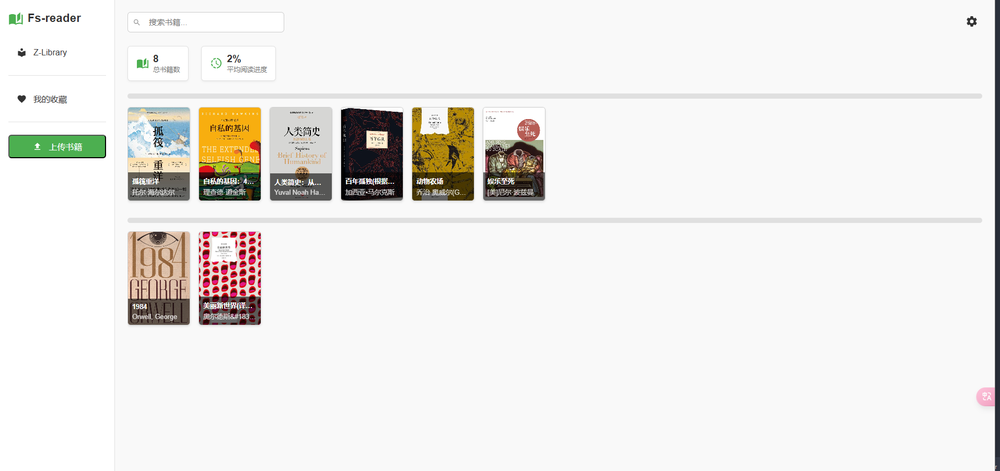
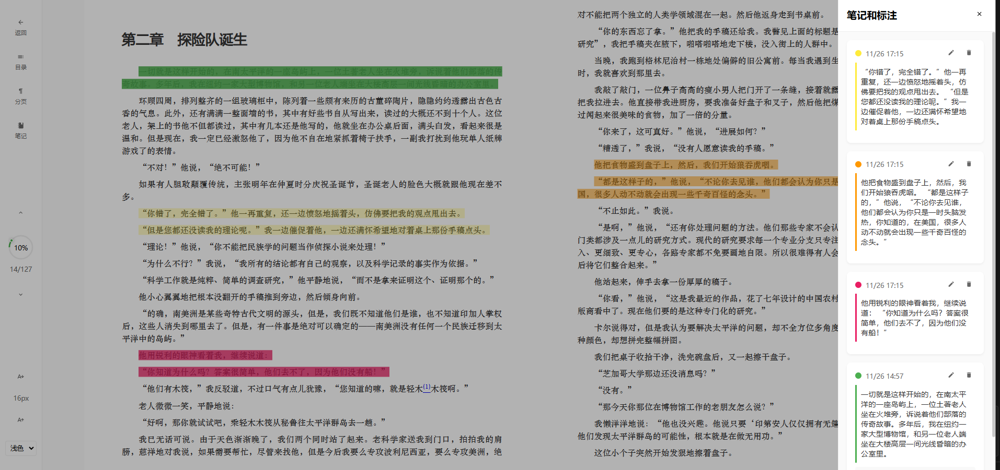

# Fs-reader

一个简洁优雅的在线电子书阅读器。

## 功能预览

### 主页面

*首页展示了书架和基本功能*

### 阅读界面

*阅读界面支持多种主题切换*

### 护眼模式

*护眼模式支持多种主题切换*


## 主要功能

- 📚 支持 EPUB 格式电子书
- 🎨 多主题切换
- ❤️ 书籍收藏
- 🔍 书籍搜索
- 📊 阅读进度追踪
- 💾 自动保存阅读位置

## 技术栈

- Vue 3
- TypeScript
- Vite
- Vue Router
- SCSS

## 部署

### Git 部署

1. 克隆项目
```bash
git clone https://github.com/your-username/fs-reader.git
cd fs-reader
```

2. 安装依赖
```bash
npm install
```

3. 构建生产环境
```bash
npm run build
```

4. 启动项目
```bash
npm run preview
```

### Docker 部署

1. 构建 Docker 镜像
```bash
docker build -t fs-reader .
```

2. 运行容器
```bash
docker run -d -p 9000:5173 fs-reader
```

或者使用 docker-compose:

```bash
docker-compose up -d
```


## 许可证

本项目采用 MIT 许可证


## 作者

- 作者：freestar
- 邮箱：freestar666666@gmail.com